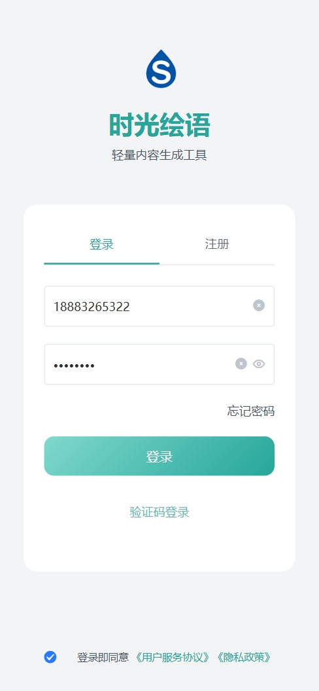
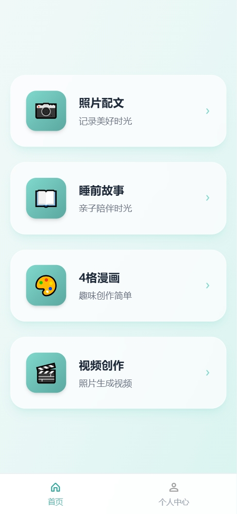
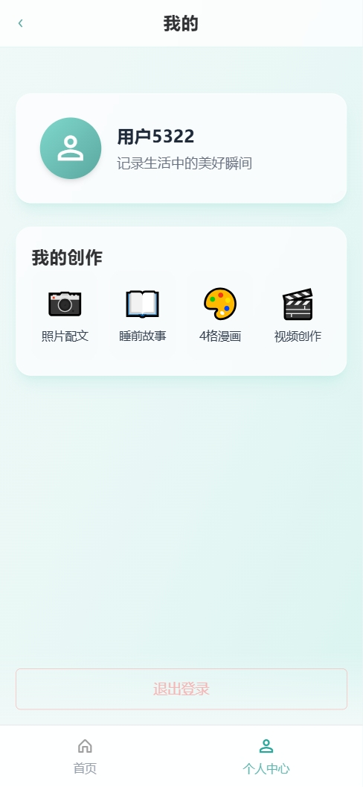
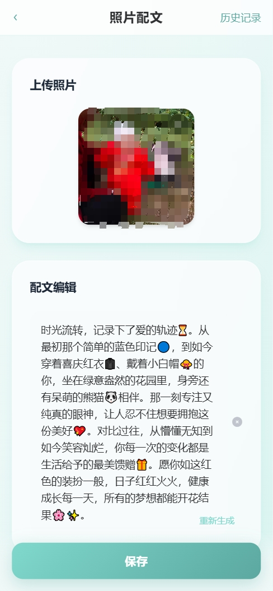
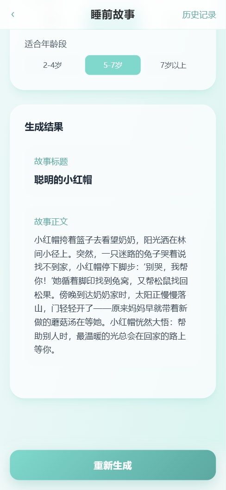
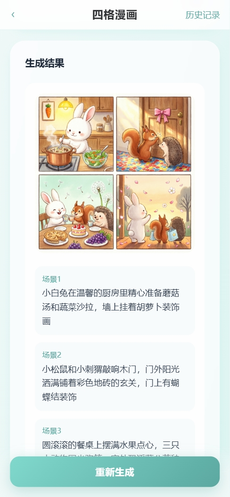
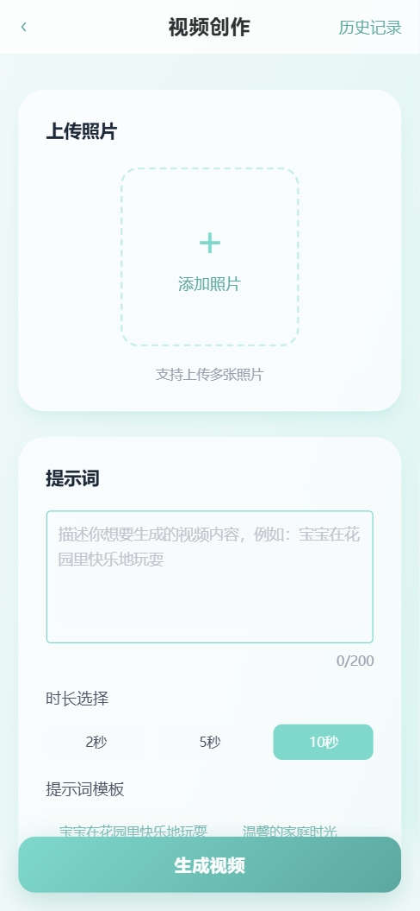
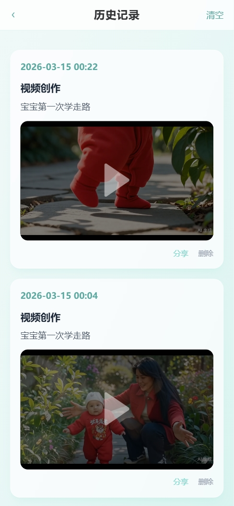

# 时光绘语

<div align="center">

一款以"便捷生成个性化内容"为核心的智能内容生成应用

[](LICENSE)
[](https://nodejs.org/)
[](https://vuejs.org/)

[功能介绍](#功能介绍) · [快速开始](#快速开始) · [项目结构](#项目结构) · [技术栈](#技术栈) · [部署指南](#部署指南) 

</div>

---

## 项目简介

时光绘语是一款基于 AI 的智能内容生成应用，专注于为用户提供便捷、个性化的内容创作体验。应用支持照片配文、睡前故事、4格漫画、视频创作四大核心功能，帮助用户轻松记录生活、陪伴孩子成长、创作有趣内容。

### 核心特性

- **照片配文生成**：上传照片，AI 自动识别内容并生成贴心配文，支持时间线关联，记录生活点滴
- **睡前故事生成**：输入关键词，AI 创作适合不同年龄段的睡前故事，支持语音朗读
- **4格漫画生成**：输入提示词，AI 生成连贯有趣的4格漫画，支持多种风格选择
- **视频创作**：输入关键词，AI 创作有趣的视频，支持多种格式导出
- **多端支持**：基于 Uni-app 开发，支持 H5、小程序、APP 多端部署
- **用户体系**：完善的登录注册、个人中心、历史记录管理
<!-- - **后台管理**：强大的后台管理系统，支持用户管理、内容审核、数据统计 -->

### 适用场景

- 📸 记录宝宝成长，生成照片配文
- 📖 陪伴孩子睡前，创作温馨故事
- 🎨 创作趣味漫画，分享到社交平台
- 🎯 快速生成内容，提升创作效率

---

## 功能展示

|  |  |  |  |
|------|---------|---------|---------|
|  |  |  |  |

|  |  |  |  |
|---------|---------|---------|---------|
|  |  |  |  |

---

## 快速开始


### 启动项目

```bash
# 克隆项目
git clone https://github.com/yourusername/baby.git
cd baby

# 配置环境变量
cp backend/.env.example backend/.env

# 编辑 .env 文件，配置以下必要参数：
# 阿里云配置
ALI_ACCESS_KEY_ID=your-ali-access-key-id
ALI_ACCESS_KEY_SECRET=your-ali-access-key-secret

# 阿里云OSS配置
OSS_REGION=your-oss-region
OSS_BUCKET=your-oss-bucket

# JWT配置
JWT_SECRET=your-jwt-secret-key
JWT_EXPIRATION=3600s

# OpenAI API 目前只支持使用阿里云百炼API秘钥
OPENAI_API_KEY=your-openai-api-key


# 启动所有服务
docker-compose up -d

# 查看服务状态
docker-compose ps

# 查看服务日志
docker-compose logs -f
```

### 访问应用

服务启动后，可通过以下地址访问：

- 前端应用：http://localhost
- 后端 API：http://localhost:3000
- API 文档：http://localhost:3000/api
- MongoDB：localhost:27017

### 停止服务

```bash
# 停止所有服务
docker-compose down

# 停止服务并删除数据卷
docker-compose down -v
```

---

## 项目结构

```
baby/
├── backend/                 # 后端服务
│   ├── src/
│   │   ├── common/         # 公共模块
│   │   │   ├── controllers/ # 公共控制器
│   │   │   ├── filters/     # 异常过滤器
│   │   │   ├── interceptors/# 响应拦截器
│   │   │   ├── services/    # 公共服务
│   │   │   └── utils/       # 工具函数
│   │   ├── users/          # 用户模块
│   │   ├── stories/        # 故事模块
│   │   ├── comics/         # 漫画模块
│   │   ├── videos/         # 视频模块
│   │   ├── posts/          # 帖子模块
│   │   └── main.ts         # 应用入口
│   ├── test/               # 测试文件
│   ├── .env.example        # 环境变量示例
│   ├── Dockerfile          # Docker 配置
│   └── package.json        # 依赖配置
├── frontend/               # 前端应用
│   ├── src/
│   │   ├── api/           # API 接口
│   │   ├── components/    # 公共组件
│   │   ├── pages/         # 页面
│   │   ├── stores/        # 状态管理
│   │   ├── styles/        # 样式文件
│   │   ├── utils/         # 工具函数
│   │   ├── App.vue        # 根组件
│   │   └── main.ts        # 应用入口
│   ├── Dockerfile         # Docker 配置
│   └── package.json       # 依赖配置
├── docker-compose.yml     # Docker Compose 配置
└── README.md             # 项目说明
```

---

## 技术栈

### 后端技术

- **框架**：NestJS - 企业级 Node.js 框架
- **数据库**：MongoDB - NoSQL 数据库
- **认证**：JWT + Passport - 用户认证与授权
- **AI 服务**：阿里云百炼大模型 - 内容生成
- **云存储**：阿里云 OSS - 文件存储
- **短信服务**：阿里云短信认证 - 短信验证码
- **文档**：Swagger - API 文档自动生成

### 前端技术

- **框架**：Vue 3 - 渐进式 JavaScript 框架
- **构建工具**：Vite - 下一代前端构建工具
- **跨端框架**：Uni-app - 多端开发框架
- **UI 组件库**：uview-pro - Vue 3 UI 组件库
- **样式方案**：TailwindCSS - 原子化 CSS 框架
- **状态管理**：Pinia - Vue 3 状态管理
- **国际化**：Vue I18n - 多语言支持

---

## 部署指南

### Docker 部署


#### 1. 启动服务

```bash
docker-compose up -d
```

#### 2. 查看日志

```bash
# 查看所有服务日志
docker-compose logs -f

# 查看特定服务日志
docker-compose logs -f backend
docker-compose logs -f frontend
```

#### 3. 停止服务

```bash
# 停止所有服务
docker-compose down

# 停止服务并删除数据卷
docker-compose down -v
```


## API 文档

启动后端服务后，访问以下地址查看 API 文档：

```
http://localhost:3000/api
```

API 文档基于 Swagger 自动生成，包含所有接口的详细说明、请求参数、响应示例等。

---


### 参考文档

- [NestJS](https://nestjs.com/)
- [Vue.js](https://vuejs.org/)
- [Uni-app](https://uniapp.dcloud.io/)
- [TailwindCSS](https://tailwindcss.com/)
- [uview-pro](https://uviewpro.cn/)

